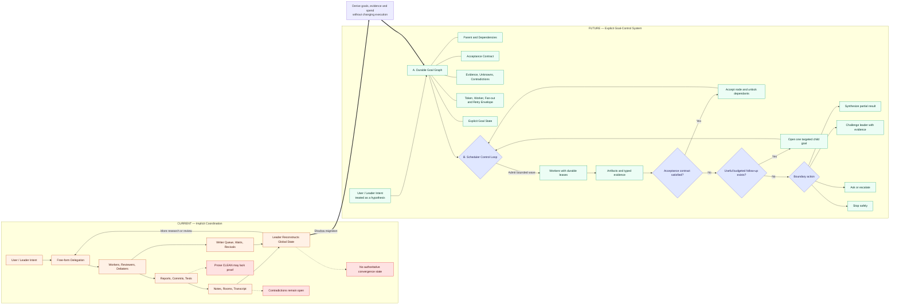

# Neta Current and Future System Flow

Today, the system reconstructs coordination state from distributed artifacts: workers generate reports and commits, reviewers and debaters add notes, transcripts capture interactions, and the leader synthesizes global state by reading these outputs. The proposed system shifts authority to a Durable Goal Graph and Scheduler Control Loop: the Goal Graph becomes the single source of truth for what needs doing and what evidence matters, while the Scheduler becomes the sole authority for admitting work, leasing workers, validating acceptance, and stopping—eliminating the need to reconstruct state and making contradictions explicit rather than latent.

## Core change

Today, the leader infers global state from coordination artifacts. The proposed architecture makes the Goal Graph the durable state authority and the Scheduler the sole authority for admission, leases, acceptance, and stopping.
