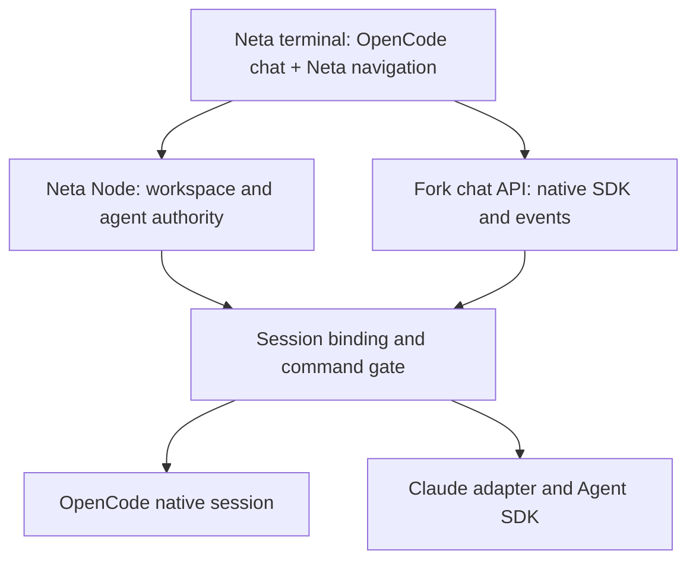

# OpenCode migration proposal

Date: 2026-09-11. Status: original design proposal, followed by an approved native
OpenCode migration. The operator explicitly deferred the Claude SDK work.

Implementation and current verification boundaries are recorded in
[docs/opencode.md](../opencode.md). The first implementation uses one native
OpenCode process per actor and its ACP control interface with a native HTTP view,
rather than the shared service considered below. Historical proposal gates are
retained here; they must not be read as claims that all release/account/remote
validation has passed.

## Decision

Use the [Neta OpenCode fork](https://github.com/sudhanshug16/neta-opencode) for the terminal client and OpenCode's native agent runtime for new conversations wherever the user's model access works. Keep OpenCode's composer, transcript, tool rendering, permissions, and general interaction feel. Add Neta's machines, workspace spine, and agent tabs around it.

Keep Neta's Node as the authority for workspaces, leaders, missions, agent identity, access, Worktrunk worktrees, writer leases, and process lifetime. Add a separate Claude Agent SDK execution path. Preserve the native OpenCode model/API path for the other providers.

These choices reflect the operator's answers: prefer the native runtime after verifying access, and keep native chat with Neta navigation. This is a runtime migration as well as a UI replacement. Existing Codex CLI sessions do not become native OpenCode sessions merely because both use OpenAI models.

### Why this boundary

| Approach | Benefit | Cost | Recommendation |
|---|---|---|---|
| OpenCode UI over all existing ACP providers | Preserves current provider behavior | Requires adapting most session, command, model, auth, and event behavior; native controls do not work automatically | Keep only for legacy compatibility and the Claude exception |
| OpenCode chat and native execution, Neta orchestration | Reuses the experience the operator actually wants | Needs lifecycle integration and a Claude session adapter | Choose this |
| Replace Neta's Node and orchestration too | One codebase could eventually own everything | Rebuilds missions, machine ownership, leases, recovery, and existing-client contracts at the same time | Defer; no demonstrated need |

## What source inspection established

The fork was inspected at `193de13a88d62a6409c6d385831180f1def527dc`, on `dev`. The latest published upstream release checked was [v1.18.30](https://github.com/anomalyco/opencode/releases/tag/v1.18.30), published September 9. Pin a tested release baseline after comparing it with the fork; do not continuously follow `dev`. The inspected tree contains both existing session code and a developing V2 runner with explicit unfinished lifecycle work.

The inspected [Toad history](https://github.com/batrachianai/toad/commits/main/) ends on May 26, 2026. That supports the maintenance concern; it does not establish that the project has formally been abandoned.

OpenCode's TUI uses its HTTP SDK and event stream. It is not a general ACP client. Its [ACP command](https://opencode.ai/docs/acp/) exposes OpenCode as an agent to external clients. Replacing a server URL with Neta's socket is therefore insufficient.

Relevant fork files, all relative to the inspected commit:

| File | Integration relevance |
|---|---|
| `packages/tui/src/context/sdk.tsx` | Native HTTP client, event subscription, directory context |
| `packages/tui/src/context/sync.tsx` | Sessions, messages, providers, permissions, questions, and capabilities |
| `packages/tui/src/component/prompt/index.tsx` | Native prompt, command, shell, and cancel paths |
| `packages/tui/src/component/dialog-model.tsx` | Model selection and variants |
| `packages/tui/src/component/dialog-provider.tsx` | Provider connection and authentication UI |
| `packages/tui/src/plugin/api.ts`, `plugin/slots.tsx` | Extension routes, slots, and keymaps |
| `packages/opencode/src/session/prompt.ts` | Existing native agent loop |
| `packages/opencode/src/acp/service.ts` | ACP adaptation, including MCP registration |
| `packages/opencode/src/cli/cmd/acp.ts` | Starts its own server; cannot assume it attaches to our existing service |
| `packages/opencode/src/cli/tui/worker.ts` | UI worker lifecycle; do not make this own durable Neta work |

The fork is [MIT licensed](https://github.com/sudhanshug16/neta-opencode/blob/193de13a88d62a6409c6d385831180f1def527dc/LICENSE). Keep its notices and credits. Brand the product Neta and keep Neta changes concentrated in extension modules and small integration patches.

## Providers and subscriptions

OpenCode documents ChatGPT Plus/Pro authentication and also lists Copilot and GitLab Duo subscription support. This is not proof that every subscription or every model on this account is available. In particular, verify the requested OpenAI models from the authenticated catalog rather than assuming Codex CLI model IDs carry over. [OpenCode provider documentation](https://opencode.ai/docs/providers/)

Claude should execute through the official Agent SDK/runtime, not through a replacement Anthropic HTTP client using copied subscription credentials. Anthropic's current help notice says SDK, `claude -p`, and third-party app usage still draw from subscription limits; its announced separate-credit change was paused. [Current usage notice](https://support.claude.com/en/articles/15036540-use-the-claude-agent-sdk-with-your-claude-plan)

There is a distribution distinction to resolve before promising universal Claude subscription support: the SDK overview restricts third-party apps offering their own Claude.ai login, while the current Claude Code terms describe running the unmodified binary with each user's own sign-in. Keep authentication in Anthropic's flow, do not collect or proxy its session tokens, and verify the exact SDK integration and distribution conditions. API-key access remains an explicit alternative, never a silent billing fallback. [SDK guidance](https://code.claude.com/docs/en/agent-sdk/overview), [authentication and product integration guidance](https://code.claude.com/docs/en/legal-and-compliance)

Neta already has useful code here: `src/acp/settings.ts` selects `@agentclientprotocol/claude-agent-acp@0.74.0`, and the installed adapter depends on `@anthropic-ai/claude-agent-sdk@0.3.257` and calls its `query` API. Start by reusing this maintained adapter. Replace the ACP wrapper with a direct SDK adapter only if the integration spike identifies missing functionality or material complexity it removes.

### A runtime is more than a model

The Claude SDK owns tool execution, conversation state, and its agent loop. Treating it as a model inside OpenCode's loop would create two competing tool loops.

Persist runtime separately from provider and model:

| Selection | Execution owner | Conversation identity |
|---|---|---|
| OpenAI/Copilot/etc. through OpenCode | Native OpenCode runtime | Native OpenCode session |
| Claude Agent | Claude SDK through the adapter | Claude runtime session |
| Existing Codex/Claude/Pi conversations | Existing Neta adapter | Existing exact vendor session |

A model change stays in the current session when its runtime supports it. Moving to a different runtime starts a fresh session with an explicit optional handoff; it does not pretend to preserve hidden context. The picker can present simple provider/model choices and explain a required new conversation only when that choice crosses the runtime boundary.

## Ownership and integration contract

Use a Node-supervised OpenCode service on each machine, reached locally or through Neta's existing SSH connection. OpenCode has [server and attach facilities](https://opencode.ai/docs/server/); process survival and reconnection still need to be proven in our packaging.

The diagram describes responsibilities, not an extra service to deploy. The command gate belongs in the fork's session dispatch layer and consults Node-owned bindings. Keep the existing native execution path after that gate. The exact insertion point must be demonstrated on the chosen release before broad edits.

- **Neta owns identity and lifecycle.** One stable owner ID for a workspace leader or agent maps to one active runtime session and a generation. Start, reset, runtime switch, cancel, access changes, and worker prompts use that binding. Chat commands cannot bypass it.
- **Each runtime owns execution and its native transcript.** OpenCode sessions keep OpenCode history. Claude sessions keep Claude history; an event adapter maintains the OpenCode-shaped display projection. A display projection cannot independently resume or replay work.
- **Neta retains its existing-client contract.** Expose normalized conversation events/history for CLI and desktop clients. A cached projection is derived from the runtime, not a second editable conversation. Version the binding and projection schemas.
- **UI state is separate.** Selected machine, workspace, owner tab, scroll, and drafts are client preferences. They cannot create leaders or declare a runtime alive.
- **Recovery is explicit.** UI disconnection leaves work running. Runtime failure produces an interrupted/failed state. Node restart reconciles stored bindings with actual processes and native sessions; it never silently replays a submitted prompt.
- **Capabilities are explicit.** Prompt/attachments, cancel, resume, model changes, tool events, questions, permissions, errors, and usage are advertised per runtime. Unsupported controls are explained before a user submits them.

### Integration risks that must be resolved early

1. **Agent authority and MCP isolation.** The inspected ACP registration calls `sdk.mcp.add` with directory, name, and configuration, not session ID. Neta currently supplies per-actor MCP credentials. A shared server must bind Neta tools to the calling session server-side; directory-wide credentials cannot distinguish two agents in one worktree. Prove isolation or use separate runtime instances until it is implemented.
2. **Native delegation.** OpenCode's native task tools cannot create unregistered writers outside Neta's mission, access, and lease rules. Adapt delegation for Neta-managed sessions. Keep ordinary chat tools and renderers native.
3. **Access modes.** OpenCode's plan/build agents are not interchangeable with Neta's Lead/Lead++ authority. Translate permissions and tool context deliberately; test both built-in and MCP tool paths.
4. **One transport per execution path.** Use native HTTP/events for native OpenCode chat. Retain ACP where useful for Claude and legacy adapters. Do not stack TUI-to-ACP-to-HTTP-to-ACP merely to preserve an old protocol requirement.
5. **Service compatibility.** Handshake on Neta and fork runtime versions/capabilities. Detect an old packaged Node before offering unsupported controls; show an in-app recovery action.

This requires a proposed manifesto update from “every conversation is real ACP” to “every view addresses the same real, Node-owned runtime session.” The exact-session, machine-local ownership and UI-independent lifetime guarantees stay. Document that change before implementation; this proposal does not silently rewrite the manifesto or retire other clients.

## First usable experience

Preserve OpenCode chat interactions. Use its extension slots/routes/keymaps for Neta navigation where possible; make small shell patches for the spine and tabs where the slots are insufficient. Adapt the Paper shell to native OpenCode chat, including a narrow-terminal treatment.

| User action or failure | Required behavior |
|---|---|
| Run bare `neta` again | Restore last machine, workspace, selected owner, and open tabs; first launch uses cwd |
| Open an explicit path | Explicit path overrides saved selection |
| Saved machine is offline | Keep the selected workspace visibly offline with Reconnect/Choose machine; do not silently show a different project |
| Switch workspace or tab | Header, breadcrumb, footer path, model, draft, permissions, and connection all derive from the selected binding |
| Open provider/model control | Show connected choices, supported models and variants for that machine; keep the current selection visible |
| `/reset` on the leader | Replace the selected leader's conversation, preserve its identity and mission registry, retain old history, keep exactly one leader row and tab |
| Reset fails | Preserve the current binding, transcript, and draft; offer a concrete recovery action |
| Expired authentication | Inline explanation plus the correct sign-in action for that runtime and machine |
| Runtime returns an error | Capture its explanation and diagnostics automatically; show useful Retry/Change model/Reset actions as applicable |
| Submit outcome is uncertain | Reconcile request/turn identity before offering retry; never duplicate work automatically |
| Close and reopen UI | Running work continues; history catches up without duplicate messages |

Use `/models` and `/connect` with native semantics where compatible. Add `/reset`, workspace/machine navigation, and Neta-specific commands to the same command palette. Surface commands relevant to the active runtime; there must be no Toad commands or actions that accidentally create a second workspace leader. Preserve useful native commands, adapting conflicts explicitly.

Reset should use a serialized operation and request ID: prepare a candidate, durably compare-and-swap the owner generation, announce the new binding, then retire the old session. Late events from the previous generation cannot recreate its tab or overwrite current state. Recover an interrupted reset from its durable operation record. Rehydrate a missing in-memory session from stored identity before declaring “no such session.”

An error card leads with the actual failure and a next action. Technical identifiers and captured diagnostics belong in expandable details. If the provider supplied no reason, say so honestly and offer app-managed recovery; “look for logs on that machine” is not the user workflow. Keep unsent and failed text available without submitting it automatically.

## Delivery sequence and gates

### 1. Prove the architecture on one workspace

Create an isolated development checkout of the fork at a pinned baseline. Register one native OpenCode session with Neta, attach the native chat to it, stream a fake-provider turn, cancel it, detach/reopen the UI, and recover its exact identity after service restart. Confirm the insertion point for Node command authority and session-specific Neta tools.

In the same spike, render a fake Claude adapter turn through the native transcript, including a tool call, question/permission, cancellation, and error. Determine whether the existing Claude ACP adapter covers the required SDK behavior.

Inventory actual provider/model availability without exposing credentials. Subscription login and any live inference smoke check are separate, user-authorized validation, never part of automated tests. Do not mark account access verified from documentation alone.

**Gate:** one leader; no second tool loop; no actor crossover; no lost or replayed turn after reconnect. Record the baseline, remaining gaps, and exact patch surface. Do not begin full shell styling if this fails.

### 2. Build the Neta shell and persistent view

Implement machine/workspace selection, spine, tabs, breadcrumb, correct worktree path, and restore behavior. Scope chat state by machine, workspace, and owner generation so events and drafts cannot bleed between tabs. Keep OpenCode's native composer, scrolling, and tool interaction.

**Gate:** keyboard and mouse walkthrough at representative narrow, medium, and wide terminal sizes; switch local/SSH workspaces and reopen into the same selection. Review screenshots against the agreed Paper shell and native chat behavior.

### 3. Complete daily controls and Claude execution

Ship provider/model selection, authentication recovery, exactly-once reset, preserved drafts, inline failures, and capability-aware commands. Connect the tested Claude adapter and normalize its events without flattening tools or permissions into plain status text. Wire Neta mission creation, agent delegation, and lease enforcement through the same session controls.

**Gate:** contract and end-to-end fixtures cover expired auth, unavailable model, generic provider failure, dead runtime, stale Node, failed/concurrent reset, active-turn model change, runtime switch, two clients, two agents in one worktree, and late events after a switch. Every test proves visible behavior and durable state, not just a helper return value.

### 4. Migrate and package

Use the new client for new sessions after the gates pass. Preserve existing transcripts and durable mission/leader records. Active legacy runs remain on their original runtime. Provide explicit fresh-session migration with optional handoff; never feed old tool-call records into a different runtime and label it a resume.

Keep Toad available as a rollback client during the transition; stop adding features to it. Preserve existing ACP provider support until the replacement/compatibility behavior is accepted. Avoid maintaining two active leaders for the same workspace during rollout.

Build a reproducible Neta distribution for the target macOS/Linux machines. The OpenTUI client brings a different runtime/artifact requirement from Neta's current Node-only bundle; package and verify it explicitly. Pin the Node/fork/adapter compatibility tuple, preserve upstream license notices, and test installation plus SSH attachment on a clean machine. A successful development command is not a packaging test.

**Gate:** install, launch, connect, prompt, detach, resume, reset, inspect failure, switch model/workspace, and rollback pass with fake runtimes; separately record any authorized account smoke checks. No main-branch switch or legacy deletion merely because a prototype renders.

## Repository and maintenance boundaries

- `neta-opencode`: native UI extensions, the narrow runtime dispatch integration, and compatible display/event adaptation.
- `neta`: Node orchestration, bindings, runtime clients, machine transport, compatibility contracts, migration, and distribution coordination.
- Version a small integration contract instead of copying Neta's whole backend into the fork or creating cross-repository relative imports.
- Use extension APIs first. Keep necessary upstream edits listed with their purpose and contract tests. Avoid broad renaming or rewriting native chat.
- Validate upstream updates in an isolated branch against the same lifecycle and interaction checks. Upgrade the working baseline deliberately.
- Automated tests use fake providers/SDK events and fixtures. No real provider keys or paid tokens. Run the fork's package-level checks and Neta's affected checks; its root test command is not the test entry point.
- Preserve the current dirty Neta checkout, legacy data, and unrelated desktop/Rust work. No commit, release, service restart, or live-session reset is part of this planning change.

The next implementation unit is the architecture spike, not a full port. Its purpose is to prove that native OpenCode chat can remain native while Neta retains correct ownership and Claude can use a separate runtime behind the same experience.
