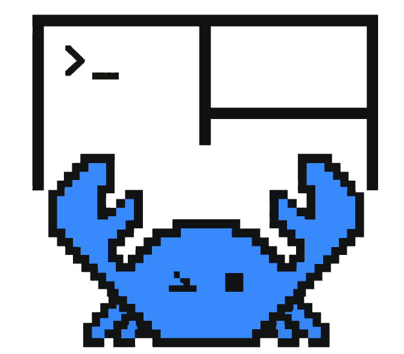
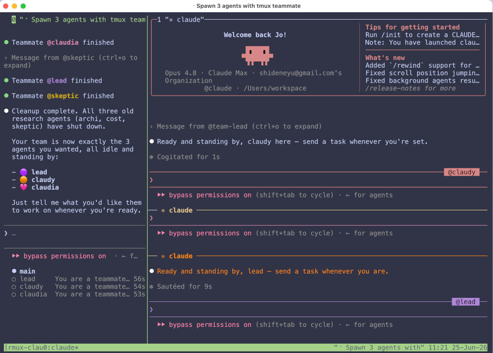

<div align="center">

<p align="center">
  <a href="https://rmux.io/">
    <picture>
      <source media="(prefers-color-scheme: dark)" srcset="../rmux-logo-dark.svg">
      
    </picture>
  </a>
</p>

<p align="center">
  <a href="https://rmux.io/">
    <picture>
      <source media="(prefers-color-scheme: dark)" srcset="../rmux-wordmark-dark.svg">
      
    </picture>
  </a>
</p>

<p align="center"><small><strong>通用多路复用引擎。</strong></small></p>

<p align="center">
  <picture><source media="(prefers-color-scheme: dark)" srcset="../readme-hero-native-dark.svg"></picture>
</p>

<p align="center">
  <picture><source media="(prefers-color-scheme: dark)" srcset="../readme-hero-rule-dark.svg"></picture>
</p>

<p align="center"><small><a href="../../README.md">English</a> · <a href="README.fr.md">Français</a> · 简体中文 · <a href="README.ja.md">日本語</a></small></p>

<p align="center">
  <a href="#verification"></a>
  <a href="https://github.com/Helvesec/rmux/actions/workflows/ci.yml?query=branch%3Amain"></a>
  <a href="https://www.bestpractices.dev/projects/13290"></a>
  <a href="https://github.com/Helvesec/rmux/releases/tag/v0.10.0"></a>
</p>

</div>


> [!NOTE]
> RMUX 现在具备 E2E Web 复用功能。[在文档中了解更多。](../web-share.md)
>
> RMUX 现在提供 Python 和 TypeScript SDK：[librmux](https://pypi.org/project/librmux/)、[@rmux/sdk](https://www.npmjs.com/package/@rmux/sdk)。
>
> 如需提出功能请求或报告问题，请[提交 issue](https://github.com/Helvesec/rmux/issues)。

<p align="center">
  <a href="https://rmux.io/docs/web-share/">
    
  </a>
</p>

<a id="what-is-rmux"></a>

## 🧭 RMUX 是什么？

RMUX 是一个现代、异步、类型化的 Rust <strong>复用器</strong>，在 macOS、Linux 和 Windows 上原生提供 90 多条 tmux 命令，无需 WSL。

它提供公共 Rust SDK 和原生 Ratatui 集成。

你可以从 CLI 使用它，在浏览器中分享会话，或从 Rust 驱动它。

<a id="features"></a>

## ✨ 功能

- 本地 daemon 架构，用于 shell、pane、window、session 和 scrollback。
- 类 tmux 命令界面，并配有聚焦的兼容性测试。
- 原生 Linux、macOS 和 Windows 后端。
- 公共 Rust SDK，用于类型化自动化和终端状态断言。
- Ratatui widget，用于在 Rust 终端应用中渲染 RMUX pane。
- 浏览器 Web Share，提供混合后量子端到端加密。
- 面向 GitHub Releases、APT、RPM、Homebrew、WinGet、Scoop、Chocolatey 和 crates.io 公共 SDK crates 的发布打包。

<a id="quick-start"></a>

## 🚀 CLI 快速开始

查看本地命令帮助：

```sh
rmux list-commands
rmux new-session --help
rmux split-window --help
rmux web-share --help
```

使用 `rmux -V` 查看已安装版本。

<a id="demos"></a>
<a id="screenshots"></a>

## 🎬 演示

一些简短示例，展示 RMUX 可以用来做什么。

<div align="center">

<table align="center">
  <tr>
    <td align="center" width="25%"><a href="https://rmux.io/#demo-orchestration"></a><br><sub><a href="https://github.com/Helvesec/rmux-demos/tree/main/demo-orchestration"><strong>多智能体编排</strong></a></sub><br><sub>≃ 514 行</sub></td>
    <td align="center" width="25%"><a href="https://rmux.io/#demo-broadcast"></a><br><sub><a href="https://github.com/Helvesec/rmux-demos/tree/main/broadcast-demo"><strong>Agent Broadcast Arena</strong></a></sub><br><sub>≃ 2,171 行</sub></td>
    <td align="center" width="25%"><a href="https://rmux.io/#demo-zellij"></a><br><sub><a href="https://github.com/Helvesec/rmux-demos/tree/main/mini-zellij"><strong>Mini-Zellij</strong></a></sub><br><sub>≃ 944 行</sub></td>
    <td align="center" width="25%"><a href="https://rmux.io/#demo-playwright"></a><br><sub><a href="https://github.com/Helvesec/rmux-demos/tree/main/terminal-playwright-demo"><strong>终端自动化</strong></a></sub><br><sub>≃ 1,495 行</sub></td>
  </tr>
</table>

</div>

<a id="installation"></a>

## 📦 安装

| 平台 / 管理器 | 命令 |
| :--- | :--- |
| <picture><source media="(prefers-color-scheme: dark)" srcset="../install/apple.svg"></picture> / Homebrew | `brew install rmux` |
| <picture><source media="(prefers-color-scheme: dark)" srcset="../install/windows.svg"></picture> / WinGet | `winget install rmux` |
| <picture><source media="(prefers-color-scheme: dark)" srcset="../install/windows.svg"></picture> / Scoop | `scoop bucket add rmux https://github.com/Helvesec/scoop-rmux && scoop install rmux` |
| <picture><source media="(prefers-color-scheme: dark)" srcset="../install/windows.svg"></picture> / Chocolatey | `choco install rmux` |
| <picture><source media="(prefers-color-scheme: dark)" srcset="../install/linux.svg"></picture> / APT | 参见 [APT 设置指南](https://rmux.io/docs/get-started/) |
| <picture><source media="(prefers-color-scheme: dark)" srcset="../install/linux.svg"></picture> / DNF | 参见 [DNF 设置指南](https://rmux.io/docs/get-started/) |
| <picture><source media="(prefers-color-scheme: dark)" srcset="../install/linux.svg"></picture> <picture><source media="(prefers-color-scheme: dark)" srcset="../install/apple.svg"></picture> / Nix | `nix profile install github:Helvesec/rmux` |
| <picture><source media="(prefers-color-scheme: dark)" srcset="../install/rust.svg"></picture> / Cargo | `cargo install rmux --locked` |

直接下载（`.tar.gz`、`.deb`、`.rpm`、`.zip`）可在 [v0.10.0 GitHub Release](https://github.com/Helvesec/rmux/releases/tag/v0.10.0) 获取。

包管理器在注册表审核新版本时可能会滞后；在管理器更新前，请使用固定版本的 GitHub Release 下载。

在 Windows 上，请解压完整的 `.zip`，并将解压后的包根目录加入
`PATH`。`rmux.exe`、`rmux-daemon.exe` 和 `libexec/rmux/rmux.exe`
必须保持在同一包布局中；仅复制公开可执行文件并不是有效安装。

对于 Unix `.tar.gz` 直接下载，请在解压后的归档目录中运行
`./install.sh --prefix ~/.local`。该安装器会保留所需的 `bin/` 和
`libexec/` 布局，确保轻量公开 CLI 始终能找到完整 helper。

发布包可能会为常用的 detached 命令使用轻量公开 CLI，并为复杂的 tmux 兼容命令形式使用私有完整 CLI helper。Windows 包将 `rmux.exe` 作为轻量 dispatcher，并把完整 CLI 放在 `libexec/rmux/rmux.exe` 下。诊断 CLI 兼容性问题时，可设置 `RMUX_DISABLE_TINY_CLI=1` 强制使用完整 helper。

<a id="claude-teammate-mode"></a>

## 🤝 Claude Teammate 模式

在本地 RMUX workspace 中运行 Claude Code，并启用
[tmux teammate mode](https://code.claude.com/docs/en/agent-teams)。

<p align="center">
  
</p>

```bash
rmux claude [args]
# 例如：rmux claude --dangerously-skip-permissions
```

RMUX 会打开一个 attached session，并自动把 `--teammate-mode tmux` 连同
你的 `[args]` 直接传给 Claude。

底层工作方式：为了正确路由命令，RMUX 会把一个私有 `tmux` shim 放到
Claude 的 `PATH` 最前面。它严格限定在 Claude 进程内，不会与你的系统
`tmux` 安装冲突。

当需要让 Claude 在本仓库之外也记住 RMUX CLI、SDK、web-share 和自动化
模式时，可以安装 RMUX 的用户级 Claude Code skill：

```bash
rmux claude install-skill
```

该 skill 会安装到 Claude 用户配置目录中（Linux/macOS 为
`~/.claude/skills/rmux`，Windows 为
`%USERPROFILE%\.claude\skills\rmux`）。仓库中的源文件保留在
`resources/claude/skills/rmux/SKILL.md`，这样项目可以打包并安装它，而不需要
在源码树中放置隐藏的 `.claude` 目录。

注意：需要在你的机器上安装 `claude`。

<a id="configuration"></a>

## ⚙️ 配置

在 Linux 和 macOS 上，RMUX 会从标准系统和用户位置读取 `.rmux.conf`：

1. `/etc/rmux.conf`
2. `~/.rmux.conf`
3. `$XDG_CONFIG_HOME/rmux/rmux.conf`
4. `~/.config/rmux/rmux.conf`

在 Windows 上，RMUX 会从以下位置读取 `.rmux.conf`：

1. `%XDG_CONFIG_HOME%\rmux\rmux.conf`
2. `%USERPROFILE%\.rmux.conf`
3. `%APPDATA%\rmux\rmux.conf`
4. `%RMUX_CONFIG_FILE%`

### `tmux.conf` 兼容性

当 RMUX 使用默认配置搜索启动，并且没有加载任何 RMUX 配置文件时，它也会检查标准 `tmux.conf` 位置。通过 `-f` 显式指定配置文件不会触发该 fallback。

Fallback 文件使用 tmux 兼容的 source parser，并以 best-effort 方式加载。支持的命令会被应用；不支持的 plugin 行会被报告，但不会中止启动。设置 `RMUX_DISABLE_TMUX_FALLBACK=1` 可禁用 autoload。

在 Unix 上，RMUX 还会在命令环境中提供按 socket 私有的 `tmux` shim，让常见 plugin script 路由回 RMUX。设置 `RMUX_DISABLE_TMUX_SHIM=1` 可禁用它。

<a id="web-sharing"></a>

## 🌐 Web Multiplex (Web Share)

RMUX 可以在浏览器中分享 pane 或 session，创建 pane，调整 split 大小，并让终端执行保持在本地。

```sh
# 在 loopback 上启动本地 Web Share
rmux web-share

# 分享命名 session
rmux new-session -d -s work
rmux web-share -t work

# 分享到 localhost 之外
rmux web-share --tunnel-provider localhost-run
```

可以使用 tunnel provider，接入自己的 ingress，或把静态 frontend 托管在自己的域名上。

有用入口：

- [仓库 Web Share 概览](../web-share.md)
- [Web Share 文档](https://rmux.io/docs/web-share/)
- [安全模型](https://rmux.io/docs/web-share/#/security)
- [Tunnel providers](https://rmux.io/docs/web-share/#/tunnels)

<a id="scripting-api"></a>

## 🧰 脚本与 API

SDK 会连接到本地 RMUX daemon，并为自动化暴露 sessions、panes、
streams、waits 和 snapshots。

```sh
cargo add rmux-sdk
pip install librmux
npm install @rmux/sdk
```

- Rust SDK：[`rmux-sdk`](https://crates.io/crates/rmux-sdk)
- Python SDK：[`librmux`](https://pypi.org/project/librmux/)
- TypeScript SDK：[`@rmux/sdk`](https://www.npmjs.com/package/@rmux/sdk)

<a id="documentation"></a>

## 📚 文档

完整 RMUX 文档可在 [rmux.io/docs](https://rmux.io/docs/) 查看。

其中包括：

- [安装指南](https://rmux.io/docs/get-started/)
- [CLI 参考](https://rmux.io/docs/cli/)
- [示例](https://rmux.io/docs/examples/)
- [API reference](https://rmux.io/docs/api/)
- [仓库 SDK 概览](../scripting-sdk.md)
- [Web Share](https://rmux.io/docs/web-share/)

如果你想要一个更符合人类使用习惯的配置，让原生终端选择保持直观，同时加入更简单的 split 绑定和剪贴板集成，请参见 [docs/human-friendly-config.md](../human-friendly-config.md)。

## 🧩 Ratatui Widget

```rust
use ratatui::{buffer::Buffer, layout::Rect, widgets::Widget};
use ratatui_rmux::{PaneState, PaneWidget};
use rmux_sdk::PaneSnapshot;

fn render(snapshot: PaneSnapshot, area: Rect, buffer: &mut Buffer) {
    let state = PaneState::from_snapshot(snapshot);
    PaneWidget::new(&state).render(area, buffer);
}
```

## 🏗️ 架构

<div align="center">

<picture>
  <source media="(prefers-color-scheme: dark)" srcset="https://rmux.io/rmux-architecture-dark.png?v=0.9.1-web-share">
  <source media="(prefers-color-scheme: light)" srcset="https://rmux.io/rmux-architecture-light.png?v=0.9.1-web-share">
  
</picture>

</div>

`rmux` 把 shell、session、window、pane 和 PTY process 保留在本地 daemon 中。本地 client 使用 IPC。Web Share 是显式的浏览器访问：daemon 通过端到端加密 WebSocket 暴露选中的 pane 或 session，而执行仍留在你的机器上。

## 🧱 工作区

| Crate | 角色 | 发布状态 |
| :--- | :--- | :--- |
| `rmux-types` | 共享的跨平台值类型 | 公开 |
| `rmux-proto` | 分离式 IPC DTO、framing、适合 wire 传输的错误 | 公开 |
| `rmux-os` | 小型 OS 边界 helper | 公开 |
| `rmux-ipc` | 本地 IPC endpoint 和 transport | 公开 |
| `rmux-sdk` | 由 daemon 支撑的 Rust SDK | 公开 |
| `ratatui-rmux` | Ratatui integration widget | 公开 |
| `rmux-web-crypto` | Web Share E2EE core 和 WASM crypto boundary | 公开 |
| `rmux-pty` | PTY allocation、resize、child process control | support crate |
| `rmux-core` | session、pane、layout、format、hook、buffer | support crate |
| `rmux-server` | Tokio daemon 和 request dispatch | support crate |
| `rmux-client` | 本地 IPC client 和 attach plumbing | support crate |
| `rmux` | CLI 和隐藏 daemon entrypoint | public binary |
| `rmux-render-core` | 共享 snapshot rendering core | workspace-internal |

<a id="platform-support"></a>

## 🖥️ 平台支持

| 平台 | PTY backend | IPC backend | 默认 endpoint |
| :--- | :--- | :--- | :--- |
| Linux | Unix PTY | Unix socket | `/tmp/rmux-{uid}/default` |
| macOS | Unix PTY | Unix socket | `/tmp/rmux-{uid}/default` |
| Windows | ConPTY | named pipe | 每用户 named pipe |

## 🧾 终端兼容性说明

RMUX 可以配合会查询终端能力的 shell 使用，包括 fish。它会响应终端设备属性探测，并处理 Escape 键时序，因此 fish prompt 和按键序列可以在 RMUX pane 中正常工作。

Graphics passthrough 可用于支持 Kitty graphics 或 SIXEL 的外层终端。RMUX 会为 Kitty、Ghostty 和 WezTerm 检测 Kitty graphics，并为 foot、mintty、mlterm、WezTerm 等终端检测 SIXEL。该功能需要显式开启：

```tmux
set -g allow-passthrough on
```

tmux 值 `all` 会因配置兼容性被接受。RMUX 渲染 attached pane，因此 `all` 当前表现得像 `on`，而不是为 unattached panes 添加 passthrough。

如果你的终端支持其中任一协议但没有被自动检测到，请添加 terminal feature override：

```tmux
set -as terminal-features 'xterm-kitty:kitty-graphics'
set -as terminal-features 'xterm*:sixel'
```

SIXEL passthrough 由自动化 Unix PTY attach 回归套件覆盖。在 Windows 上，如果 OS 支持，RMUX 会启用现代 ConPTY passthrough，但 SIXEL 显示仍取决于外层终端。排查问题时可设置 `RMUX_CONPTY_NO_PASSTHROUGH=1` 来禁用该 backend mode。

<a id="verification"></a>

## 🧪 验证

该 workspace 设计为可从源码使用锁定依赖进行检查：

```sh
cargo fmt --all -- --check
cargo clippy --workspace --all-targets --locked -- -D warnings
cargo test --workspace --locked --no-fail-fast
```

额外本地检查：

```sh
scripts/cfg-check.sh
scripts/unsafe-check.sh
scripts/no-network-in-runtime.sh
scripts/check-platform-neutrality.sh
scripts/ratatui-rmux-budget.sh
scripts/verify-package.sh
```

Release artifact checks 由以下脚本驱动：

```sh
scripts/release-local.sh
scripts/package-unix.sh
scripts/package-debian.sh
scripts/verify-debian-package.sh
scripts/package-rpm.sh
scripts/verify-rpm-package.sh
scripts/smoke-snap-package.sh
scripts/package-windows.ps1
scripts/verify-package-windows.ps1
scripts/generate-apt-repository.sh
scripts/generate-rpm-repository.sh
scripts/generate-homebrew-formula.sh
scripts/generate-winget-manifest.sh
scripts/generate-scoop-manifest.sh
scripts/generate-chocolatey-package.sh
```

上层 crates 使用 `#![forbid(unsafe_code)]`。OS 和 terminal boundary code 被隔离在较低层 runtime crates 中。

## ⚖️ 许可证

RMUX 采用双许可证，可任选其一：

- [MIT License](../../LICENSE-MIT)
- [Apache License 2.0](../../LICENSE-APACHE)
